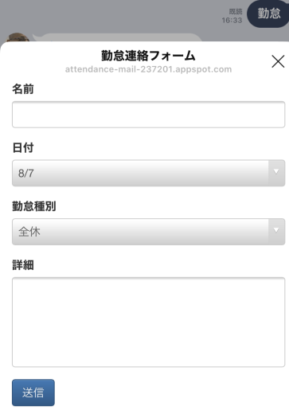
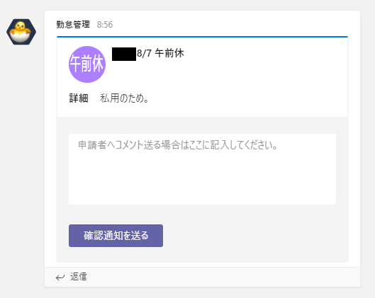
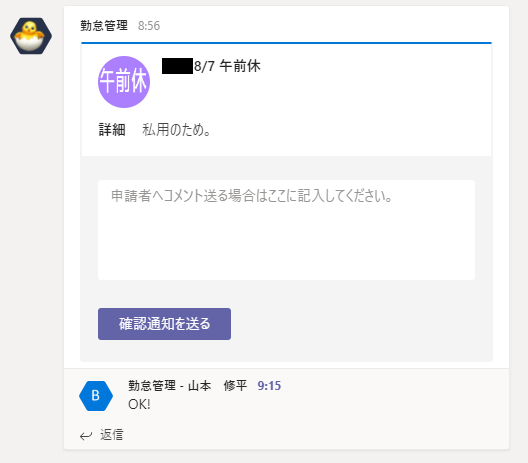
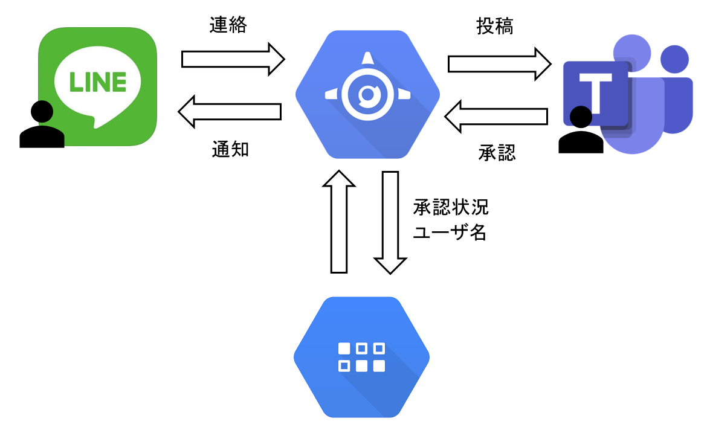

# 勤怠連絡アプリ（LIFF to Teams）
LineからTeamsに勤怠連絡を投稿し、確認フィードバックを受け取るアプリです。

* Lineの[LIFF](https://developers.line.biz/ja/docs/liff/overview/)を経由してTeamsに勤怠連絡を投稿します。
* Teams上で、勤怠連絡を確認し、確認したことを送信します。
* Teams上で確認されたことを、Lineを経由して確認します。

# 操作フロー

Lien上で、勤怠連絡用のLIFFを呼び出します。 

勤怠連絡フォームに書き込みます。 

Teams上にフォームに書き込んだ内容が投稿されます。 

コメント（オプション）をつけて送信します。 

Line上に確認通知が届きます。 

## アーキテクチャ

## その他
* あらかじめ[Line Developers](https://developers.line.biz/ja/)に登録をする必要があります。
* あらかじめGCPのアカウントを登録する必要があります。
  * GAEでのアプリケーション作成方法は省略
* あらかじめTeamsのwebhook urlを生成する必要があります。
* app.yaml.tmpをapp.yamlにリネームして、各項目を記入する必要があります。
  * CHANNEL_SECRET: Line Botのチャンネルシークレットキー
  * CHANNEL_ACCESS_TOKEN: Line Botのチャンネルのアクセストークン
  * HOME_URL: GAEのurl（最後にスラッシュつける）
  * LIFF_URL: LIFFのurl
  * WEBHOOK_URL: Teamsのwebhook url
  * WEBHOOK_URL_SUB: Teamsのwebhook url（メインに送信できなかった場合の予備）